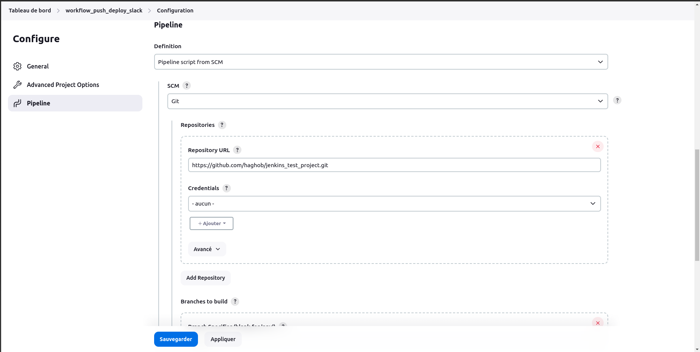

# Lancement du service jenkins :

Pour lancer le service jenkins deux phases sont nécessaires, il est possible d'utiliser soit la commande docker soit la commande docker-compose. 

### La phase de construction de l'image docker (build) :

Cette phase n'est nécessaire qu'une seule fois pour la construction de l'image docker

Avec docker (nom de l'image jenkins-cust) :

```bash
docker build -t jenkins-cust
```

Avec docker-compose (nom sera généré en fonction du nom du service docker-compose) :

```bash
docker-compose build
```

### La phase du lancement du conteneur (run) :

Pour lancer le conteneur docker exécutant le service jenkins et ouvrant les ports 8080 et 50000 du conteneur vers les ports respectifs de ma machine locale 8081 et 50000.

Avec docker (cette commande ne tient pas compte des différents volumes nécessaires pour le reste du travail) :

```bash
docker run --rm --name myjenkins -p 8080:8081 -p 50000:50000 jenkins-cust
```

Avec docker-compose (il est nécessaire d'utiliser cette commande) :

```bash
docker-compose up -d
```


# Étapes 

### Dockerfile pour Jenkins :

création d'un Dockerfile personnalisé pour Jenkins, lui permettant d'être exécuté dans un conteneur Docker

### Configuration du pipeline Jenkins

Pour configurer le pipeline Jenkins, j'ai suivi les étapes suivantes :

1. Dans l'interface Jenkins, j'ai créé un nouvel élément de type *Pipeline**.
2. Dans la section **Pipeline**, j'ai choisi **Pipeline script from SCM** dans le menu déroulant **Definition**.
3. J'ai sélectionné **Git** comme SCM.
4. J'ai ajouté l'URL de mon dépôt Git dans le champ **Repository URL**.

Cela a permis à Jenkins de récupérer le Jenkinsfile de mon dépôt Git et d'exécuter le pipeline défini dans ce fichier.

Cette configuration nécessite que mon dépôt Git contienne un fichier Jenkinsfile à la racine. Ce fichier définit les étapes de mon pipeline, y compris les tests à exécuter, les environnements sur lesquels exécuter ces tests, et les actions à entreprendre en fonction des résultats de ces tests.




### Intégration de la gestion des identifiants : 

J'ai ajouté la gestion sécurisée des identifiants en utilisant les credentials de Jenkins pour stocker et récupérer les secrets nécessaires dans le pipeline

### Configuration d'un déclenchement basé sur les changements de dossier : 

J'ai configuré le pipeline pour qu'il ne s'exécute que lorsqu'un changement a lieu dans un dossier spécifique du répertoire

### Automatisation du rollback en cas d'échec de déploiement : 

J'ai ajouté une gestion des erreurs pour automatiser le rollback en cas d'échec du déploiement, pour assurer aussi une meilleure fiabilité du processus de déploiement

### Intégration de l'analyse de code statique et des rapports de couverture de tests : 

J'ai ajouté des étapes pour effectuer l'analyse de code statique et générer les rapports de couverture de tests dans le pipeline Jenkins


http://localhost:8081